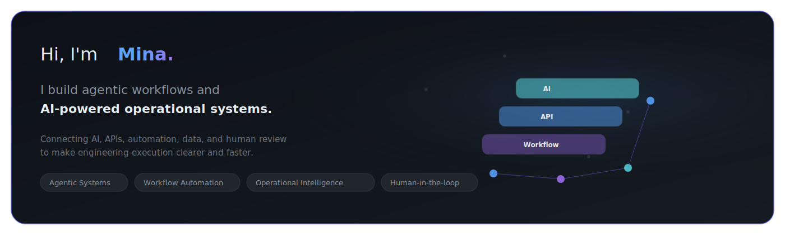
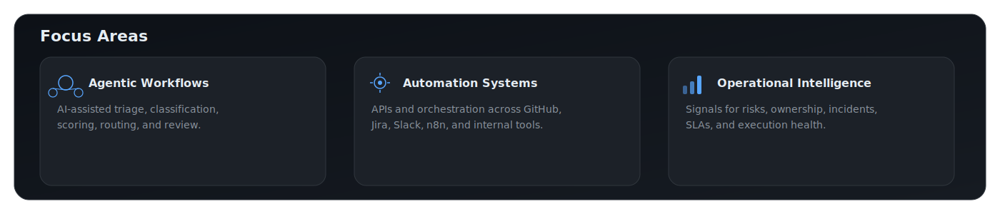
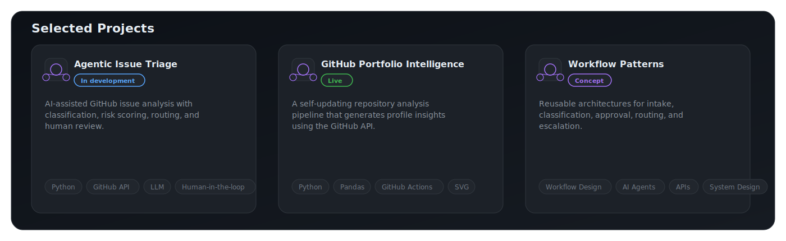
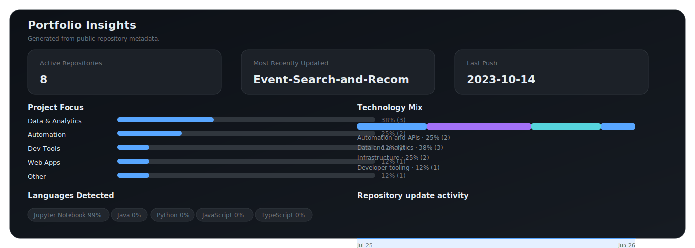

  <picture>
    <source media="(prefers-color-scheme: dark)" srcset="./assets/profile_hero_dark.svg">
    <source media="(prefers-color-scheme: light)" srcset="./assets/profile_hero_light.svg">
    
  </picture>

## Focus Areas

  <picture>
    <source media="(prefers-color-scheme: dark)" srcset="./assets/focus_areas_dark.svg">
    <source media="(prefers-color-scheme: light)" srcset="./assets/focus_areas_light.svg">
    
  </picture>

## Selected Projects

  <picture>
    <source media="(prefers-color-scheme: dark)" srcset="./assets/selected_projects_dark.svg">
    <source media="(prefers-color-scheme: light)" srcset="./assets/selected_projects_light.svg">
    
  </picture>

**GitHub Portfolio Intelligence** is live in this repository: [Mina314/Mina314](https://github.com/Mina314/Mina314)

## Portfolio Insights

  <picture>
    <source media="(prefers-color-scheme: dark)" srcset="./assets/portfolio_insights_dark.svg">
    <source media="(prefers-color-scheme: light)" srcset="./assets/portfolio_insights_light.svg">
    
  </picture>

Automatically generated from public repository metadata using the GitHub API and GitHub Actions.

Earlier data engineering projects: [datascienceportfol.io/mina](https://www.datascienceportfol.io/mina)

## Toolkit

`Python` · `SQL` · `JavaScript` · `GitHub API` · `Jira API` · `Slack` · `n8n` · `Google Apps Script` · `Pandas` · `PostgreSQL` · `Airflow` · `Grafana`

---

> I build systems that turn operational complexity into clear, reviewable action.

[LinkedIn](https://www.linkedin.com/in/mina-liu-114200/) · [Email](mailto:minazliu@gmail.com)
