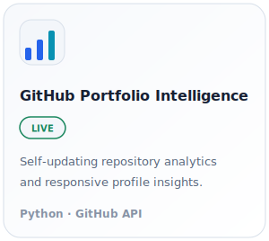
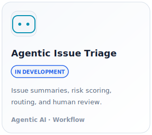
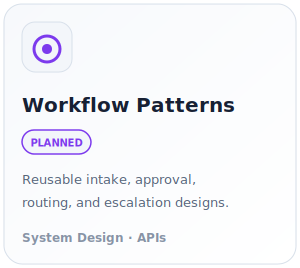

  <picture>
    <source
      media="(prefers-color-scheme: dark)"
      srcset="./assets/intro_dark.svg?v=3"
    >
    <source
      media="(prefers-color-scheme: light)"
      srcset="./assets/intro_light.svg?v=3"
    >
    
  </picture>

## Focus Areas

<table>
<tr>
<td width="33%" valign="top">
<a href="https://github.com/minazliu?tab=repositories">
  <picture>
    <source
      media="(prefers-color-scheme: dark)"
      srcset="./assets/focus_agentic_dark.svg"
    >
    <source
      media="(prefers-color-scheme: light)"
      srcset="./assets/focus_agentic_light.svg"
    >
    
  </picture>
</a>
</td>

<td width="33%" valign="top">
<a href="https://github.com/minazliu?tab=repositories">
  <picture>
    <source
      media="(prefers-color-scheme: dark)"
      srcset="./assets/focus_automation_dark.svg"
    >
    <source
      media="(prefers-color-scheme: light)"
      srcset="./assets/focus_automation_light.svg"
    >
    
  </picture>
</a>
</td>

<td width="33%" valign="top">
<a href="https://www.datascienceportfol.io/mina">
  <picture>
    <source
      media="(prefers-color-scheme: dark)"
      srcset="./assets/focus_intelligence_dark.svg"
    >
    <source
      media="(prefers-color-scheme: light)"
      srcset="./assets/focus_intelligence_light.svg"
    >
    
  </picture>
</a>
</td>
</tr>
</table>

## Selected Projects

<table>
<tr>
<td width="33%" valign="top">
<a href="https://github.com/minazliu/minazliu">
  <picture>
    <source
      media="(prefers-color-scheme: dark)"
      srcset="./assets/project_portfolio_dark.svg"
    >
    <source
      media="(prefers-color-scheme: light)"
      srcset="./assets/project_portfolio_light.svg"
    >
    
  </picture>
</a>
</td>

<td width="33%" valign="top">
<a href="https://github.com/minazliu?tab=repositories">
  <picture>
    <source
      media="(prefers-color-scheme: dark)"
      srcset="./assets/project_triage_dark.svg"
    >
    <source
      media="(prefers-color-scheme: light)"
      srcset="./assets/project_triage_light.svg"
    >
    
  </picture>
</a>
</td>

<td width="33%" valign="top">
<a href="https://github.com/minazliu?tab=repositories">
  <picture>
    <source
      media="(prefers-color-scheme: dark)"
      srcset="./assets/project_patterns_dark.svg"
    >
    <source
      media="(prefers-color-scheme: light)"
      srcset="./assets/project_patterns_light.svg"
    >
    
  </picture>
</a>
</td>
</tr>
</table>

## Portfolio Insights & Activity

  <picture>
    <source
      media="(prefers-color-scheme: dark)"
      srcset="./assets/insights_activity_dark.svg?v=5"
    >
    <source
      media="(prefers-color-scheme: light)"
      srcset="./assets/insights_activity_light.svg?v=5"
    >
    
  </picture>

Repository insights and activity are refreshed automatically with GitHub Actions.

  

`Python` · `SQL` · `JavaScript` · `GitHub API` · `Jira API` · `Slack` · `n8n` · `Google Apps Script` · `PostgreSQL` · `Airflow` · `Grafana`

---

[LinkedIn](https://www.linkedin.com/in/mina-liu-114200/) ·
[Data Portfolio](https://www.datascienceportfol.io/mina) ·
[Email](mailto:minazliu@gmail.com)
